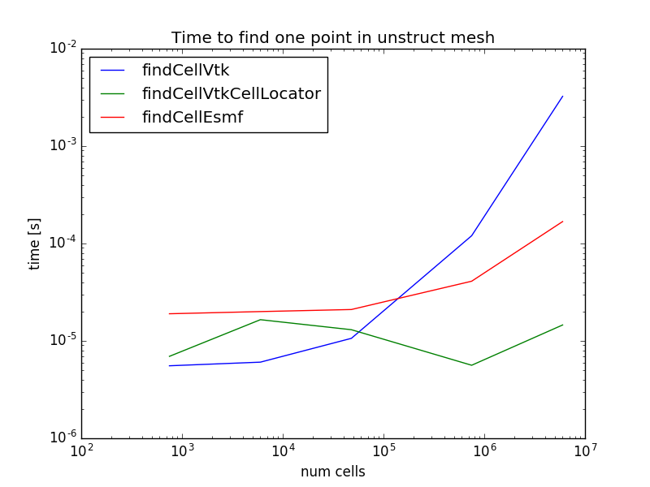

# findCell

Comparing different libraries for finding the unstructured grid cell that contains a point

## How to build

You will need python 2.7 and the libraries ESMF (tested with 7.0.2) and VTK (tested with 8.0.1) built. To generate the input files, you will need to have VTK built with python enabled. 

You'll need to set:

 * ```fortran_compiler_id```: currently either "Intel" or "GNU". This determines the Fortran libraries to link the C++ executables against. 
 * ```ESMF_DIR```: the top directory where ESMF was built
 * ```ESMF_OS```: either "Linux" or "Darwin". Determines the location of the ESMF library.
 * ```ESMF_COMM```: either "mpich" or "openmpi". Determines the location of the ESMF library.
 * ```MPI_DIR```: the MPI libraries are assumed to be located under $MPI_DIR/lib
 * ```VTK_DIR```: the path to UseVTK.cmake, typically under /vtk_top_dir/lib/cmake/vtk-version/

To compile, type:

 * ```git clone https://github.com/pletzer/findCell```
 * ```cd findCell; mkdir build; cd build```
 * ```cmake -DFORTRAN_COMPILER_ID=$fortran_compiler_id -DESMF_DIR=$ESMF_DIR -DESMF_OS=$ESMF_OS -DESMF_COMM=$ESMF_COMM -DMPI_DIR=$MPI_DIR -DVTK_DIR=$VTK_DIR ..```
 * ```make```


## How to run

```cd ../input_data``` and run ```python generateTargetPoints.py -N 100000 -r 0.1 -o points.vtk```; this will generate 100k random target points on the sphere with relative extrusion of 0.1. ```sh generateCubedSphereMesh.sh```; this will generate cubed-sphere 3D meshes of various resolutions and save the meshes in VTK files (cs*.vtk). 

```cd ../build``` and run the tests: ```sh input_data/runFindCell.sh > results.csv``` (this may take up to a few hours). You can plot the results with ```python plotResults.py -i results.csv```.

## Results

Below we searched 100,000 points randomly distributed one a cubed-sphere mesh expressed in Cartesian coordinates. The results showing the average time to find one point in the mesh, including the time to set up the cell 
locator data structure. The vtkCellLocator class is able to find the cell containing a point in near constant time (about 10 microseconds, 100 cells per bucket) as the mesh resolution increases (up to 60 million cells). 



